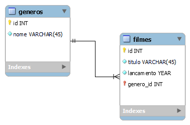

# Exercícios de Modelagem

**16/08/2023**

## No phpMyAdmin utilize comandos SQL para fazer a modelagem física do exercício anterior.

Você deve:

- Criar um novo banco de dados (Catálogo de Filmes)
- Criar duas tabelas (Gêneros e Filmes)
- Fazer o relacionamento entre as tabelas

---

**15/08/2023**

## Crie no MySQL Workbench o modelo lógico para 2 entidades:

1) Gêneros
    - Identificador
    - Nome do gênero

2) Filmes
    - Identificador
    - Título do filme
    - Ano do lançamento
    - Gênero do Filme

**Obs.:** o filme deve ter um gênero relacionado à tabela de genêros.

---

## Exercício resolvido:

