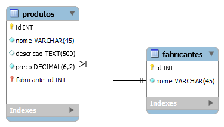

# Exercícios de Modelagem

**17/08/2023**

## Usando SQL em seu banco de dados `vendas`, insira mais dois produtos na tabela produtos:
1) Xbox Series S
    - Descrição: Velocidade e desempenho de última geração.
    - Valor: R$ 1.997,00
    - Quantidade: 5
    - Fabricante: Microsoft
2) Notebook Motion
    - Descrição: Intel Dual Core 4GB de RAM, 128GB SSD e Tela 14,1 polegadas.
    - Valor: R$ 1.213,65
    - Quantidade: 8
    - Fabricante: Positivo
---

**16/08/2023**

## Refaça o exercício anterior de modelagem física (banco de dados de catalogo de Filmes e Gêneros) usando somente ferramentas da interface gráfica do phpMyAdmin.

---

**15/08/2023**

## No phpMyAdmin utilize comandos SQL para fazer a modelagem física do exercício anterior.

Você deve:

- Criar um novo banco de dados (Catálogo de Filmes)
- Criar duas tabelas (Gêneros e Filmes)
- Fazer o relacionamento entre as tabelas

---

**14/08/2023**

## Crie no MySQL Workbench o modelo lógico para 2 entidades:

1) Gêneros
    - Identificador
    - Nome do gênero

2) Filmes
    - Identificador
    - Título do filme
    - Ano do lançamento
    - Gênero do Filme

**Obs.:** o filme deve ter um gênero relacionado à tabela de genêros.

---

## Exercício resolvido:

